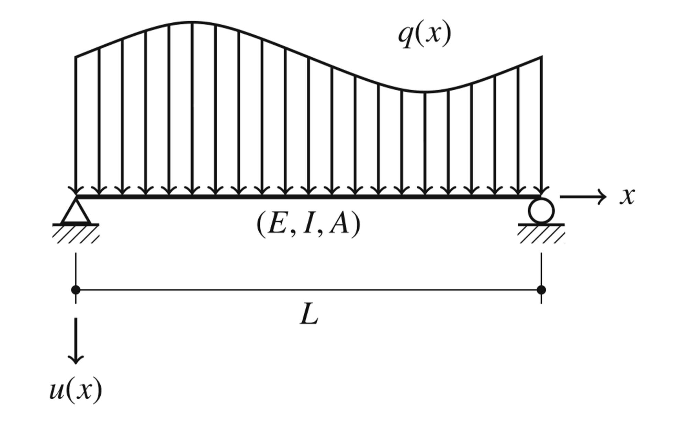

# Viga de euler

## Teoria de vigas

Considerando a viga representada a equação governante do problema pode ser escrita como : 

$EI \frac{\mathrm{d}^{4}u}{\mathrm{d}x^{4}}=q(x)$

A partir de $u$  as podemos definir:

$\varphi=\frac{\mathrm{d}u}{\mathrm{d}x},\quad M=-EI\frac{\mathrm{d}^{2}u}{\mathrm{d}x^{2}},\quad\mathrm{e}\quad Q=-EI\frac{\mathrm{d}^{3}u}{\mathrm{d}x^{3}}$ que são a rotação, momento fletor e cortante.



usando essas definições, aplicando o método dos resíduos ponderados e integração por partes 4 vezes obtemos:

$$
\begin{aligned}u(\xi)& =+ u^{*}(\xi,x) Q(x) \bigg|_{x=L}- u^{*}(\xi,x) Q(x) \bigg|_{x=0} \\&-\left.\varphi^*(\xi,x)M(x)\right|_{x=L}+\left.\varphi^*(\xi,x)M(x)\right|_{x=0} \\&+\left.M^{*}(\xi,x)\varphi(x)\right|_{x=L}-\left.M^{*}(\xi,x)\varphi(x)\right|_{x=0} \\&- Q^{*}(\xi,x)u(x)\bigg|_{x=L}+ Q^{*}(\xi,x)u(x)\bigg|_{x=0} \\&+\int_{0}^{L}u^{*}(\xi,x)q(x) \mathrm{d}x,\end{aligned}
$$

onde:

$$
u^{*}(\xi,x)=\frac{r^{3}}{12EI},\\

\varphi^{*}(\xi,x) =\frac{r^{2}}{4EI}\left(\frac{\partial r}{\partial x}\right), \\
M^{*}(\xi,x) = -\frac r2 \left(\frac{\partial r}{\partial x}\right)^2, \\
Q^{*}(\xi,x) = -\frac{1}{2} \left(\frac{\partial r}{\partial x}\right)^{3}\text{ e }\\
r=|x-\xi |
$$

onde ${\frac{\partial r}{\partial x}}=-1 {\mathrm{\quad  se \quad}} x<\xi$ e ${\frac{\partial r}{\partial x}}=1 {\mathrm{\quad  se \quad}} x>\xi$.

Para esse problema precisamos de definir mais uma equação para conseguirmos montar um sistema de equação adequado. Isso é obtido derivando a equação anterior em relação à $\xi$:

$$
\begin{gathered}\varphi(\xi) =+\left.\frac{\partial u^{*}(\xi,x)}{\partial\xi}Q(x) \right|_{x=L}-\left.\frac{\partial u^{*}(\xi,x)}{\partial\xi}Q(x) \right|_{x=0} \\-\left.\frac{\partial\varphi^{*}(\xi,x)}{\partial\xi}M(x)\right|_{x=L}+\left.\frac{\partial\varphi^{*}(\xi,x)}{\partial\xi}M(x)\right|_{x=0} \\+\left.\frac{\partial M^{*}(\xi,x)}{\partial\xi}\varphi(x)\right|_{x=L}-\left.\frac{\partial M^{*}(\xi,x)}{\partial\xi}\varphi(x)\right|_{x=0} \\+\int_{0}^{L}\frac{\partial u^{*}(\xi,x)}{\partial\xi}q(x) \mathrm{d}x, \end{gathered}
$$

onde:

$$
\begin{aligned}&\frac{\partial u^{*}(\xi,x)}{\partial\xi}=\frac{r^{2}}{4EI}\left(\frac{\partial r}{\partial\xi}\right), \\&\frac{\partial\varphi^{*}(\xi,x)}{\partial\xi}=\frac{r}{2EI}\left(\frac{\partial r}{\partial\xi}\right)\left(\frac{\partial r}{\partial x}\right), \\&\frac{\partial M^{*}(\xi, x)}{\partial\xi}=\frac{1}{2}\left(\frac{\partial r}{\partial\xi}\right)\left(\frac{\partial r}{\partial x}\right)^{2},\end{aligned}
$$

onde ${\frac{\partial r}{\partial\xi}}=1 {\mathrm{\quad  se \quad}} x<\xi$ e ${\frac{\partial r}{\partial\xi}}=-1 {\mathrm{\quad  se \quad}} x>\xi$.

```julia
function solfundviga(ξ, x,E,I,L)
	r=abs(x-ξ)
	if x==ξ
		if ξ==0
			drdx=1
		elseif ξ==L
			drdx=-1
		else
			drdx=0
		end
	else
		drdx=(x-ξ)/r
	end
	drdξ=-drdx
	
	u_star = r^3 / (12 * E * I)
	phi_star = (r^2 / (4 * E * I)) * drdx
	M_star = -r/2 * drdx^2
	Q_star = -1/2 * drdx^3
	
	du_star_dxi = (r^2 / (4 * E * I)) * drdξ
	dphi_star_dxi = (r / (2 * E * I)) * drdξ * drdx
	dM_star_dxi = 1/2 * drdξ * drdx^2
	
	u_star ,phi_star ,M_star ,Q_star ,du_star_dxi ,dphi_star_dxi ,dM_star_dxi
end

```

Considere uma viga com $L=4 \text{m}$, $E=50\text{GPa}$, $I=0.0036\text{m}^2$ e uma carga pontual no centro da viga de valor $10$KN.

```julia
L=4
E=50e9
Iv=0.0036

#solfundviga(ξ, x,E,I,L)
u_00 ,phi_00 ,M_00 ,Q_00 ,du_00 ,dphi_00,dM_00= solfundviga(0,0,E,Iv,L)
u_0L ,phi_0L ,M_0L ,Q_0L ,du_0L ,dphi_0L,dM_0L= solfundviga(0,L,E,Iv,L)
u_L0 ,phi_L0 ,M_L0 ,Q_L0 ,du_L0 ,dphi_L0,dM_L0= solfundviga(L,0,E,Iv,L)
u_LL ,phi_LL ,M_LL ,Q_LL ,du_LL ,dphi_LL,dM_LL= solfundviga(L,L,E,Iv,L)
#multiplica U e phi
H=-[Q_00 -M_00 -Q_0L  M_0L
		0 dM_00 0  -dM_0L
		Q_L0 -M_L0 -Q_LL  M_LL
		0 dM_L0 0  -dM_LL]
		#multiplica V e M
G=[-u_00 phi_00 u_0L  -phi_0L
		-du_00 dphi_00 du_0L  -dphi_0L
		-u_L0 phi_L0 u_LL  -phi_LL
		-du_L0 dphi_L0 du_LL  -dphi_LL]

uc0 ,phic0 ,Mc0 ,Qc0 ,duc0 ,dphic0,dMc0=solfundviga(0,L/2,E,Iv,L)
ucL ,phicL ,McL ,QcL ,ducL ,dphicL,dMcL=solfundviga(L,L/2,E,Iv,L)
b=1e4*[uc0;duc0 ;ucL;ducL]

A=[-G[:,1] H[:,2] -G[:,3] H[:,4]]
x=A\b

```

### Exercício

1- Generalize esse código para qualquer condição de contorno. Ele é capaz de resolver problemas hiperestáticos? Como? 

2- Generalize esse código para qualquer carga distribuída e compare com a solução analítica. 

# Efeitos transientes


$$
\begin{aligned}EI\frac{\partial^4u}{\partial x^4}+\rho A\frac{\partial^2u}{\partial t^2}=f(x,t)\end{aligned}
$$

Dividindo a equação por $\rho A$ e definindo

$$
c=\sqrt{\frac{EI}{\rho A}}
$$

obtém-se a expressão:

$$
\begin{aligned}c^2\frac{\partial^4u}{\partial x^4}+\frac{\partial^2u}{\partial t^2}=\frac{f(x,t)}{\rho A}\end{aligned}
$$

a solução fundamental para esse problema é dada por:

$$
u^{*}(x,\xi,t,\tau)=\frac{1}{c}\left\{\frac{r}{2}\left[\mathrm{S}\left(\frac{r}{\sqrt{2\pi a}}\right)-\mathrm{C}\left(\frac{r}{\sqrt{2\pi a}}\right)\right]+\frac{\sqrt{a}}{\sqrt{2\pi}}\left[\sin\left(\frac{r^{2}}{4a}\right)+\cos\left(\frac{r^{2}}{4a}\right)\right]\right\}

$$

onde as funções S e C são denominadas [integrais de Fresnel](https://kiranshila.github.io/FresnelIntegrals.jl/dev/), $r=|x-\xi|$e $a=c(t-\tau)$.

$$
\begin{gathered}\theta^{*} (x,\xi,t,\tau) =+\frac{1}{c}\left\{\frac{1}{2}\left[ \mathrm{S}\left(\frac{r}{\sqrt{2\pi a}}\right)-\mathrm{C}\left(\frac{r}{\sqrt{2\pi a}}\right)\right]\right\}\left(\frac{\partial r}{\partial x}\right), \\M^{*}(x,\xi,t,\tau) =-\frac{EI}{c}\Bigg\{\frac{1}{2\sqrt{2\pi a}}\Bigg[\sin\Bigg(\frac{r^2}{4a}\Bigg)-\cos\Bigg(\frac{r^2}{4a}\Bigg)\Bigg]\Bigg\}\Bigg(\frac{\partial r}{\partial x}\Bigg)^2, \\Q^{*}\left(x,\xi,t,\tau\right) =-\frac{EI}{c}\Bigg\{\frac{r}{4\sqrt{2\pi a^{3}}}\Bigg[\sin\left(\frac{r^{2}}{4a}\right)+\cos\left(\frac{r^{2}}{4a}\right)\Bigg]\Bigg\}\Bigg(\frac{\partial r}{\partial x}\Bigg)^{3}, \end{gathered}
$$

 A equação integral para esse problema é dada por:

$$
\begin{aligned}u(\xi,t)=& - \frac{1}{\rho A}\int_{0}^{t}\Big[ + u^{*}Q-\theta^{*}M+M^{*}\theta-Q^{*}u\Big]_{x=0} \mathrm{d}\tau  \\&+\frac{1}{\rho A}\int_{0}^{t}\Big[+u^{*}Q-\theta^{*}M+M^{*}\theta-Q^{*}u\Big]_{x=L} \mathrm{d}\tau \\&+\frac{1}{\rho A}\int_{0}^{t}\int_{0}^{L}u^{*}f \mathrm{d}x \mathrm{d}\tau.\end{aligned}
$$

A solução do problema, que envolve quatro incógnitas de contorno, requer ao menos
duas equações integrais distintas. Assim, escreve-se, para a rotação:

$$
\begin{aligned}\theta(\xi,t)=& - \frac{1}{\rho A}\Bigg\{ \int_{0}^{t}\Big[ \frac{\partial u^{*}}{\partial\xi}Q-\frac{\partial \theta^{*}}{\partial\xi}M+\frac{\partial M^{*}}{\partial\xi}\theta-\frac{\partial Q^{*}}{\partial\xi}u\Big]_{x=0} \mathrm{d}\tau\Bigg\} \\&+\frac{1}{\rho A}\Bigg\{\int_{0}^{t}\Big[\frac{\partial u^{*}}{\partial\xi}Q-\frac{\partial \theta^{*}}{\partial\xi}M+\frac{\partial M^{*}}{\partial\xi}\theta-\frac{\partial Q^{*}}{\partial\xi}u\Big]_{x=L}\mathrm{d}\tau\Bigg\} \\&+\frac{1}{\rho A}\Bigg\{ \int_{0}^{t}\int_{0}^{L}\frac{\partial u^{*}}{\partial\xi}f \mathrm{d}x \mathrm{d}\tau\Bigg\},\end{aligned}
$$

### Exercício

3 - Faça um gráfico 3d de $u^{*}$ e $du^{*}/d\xi$. Considere $\xi$ e $\tau$ iguais a zero, que o tempo varia de 0 a 10s e que o  $x$ varia de $0$ a $L$. [Exemplo de superfície](https://docs.juliaplots.org/stable/gallery/gr/generated/gr-ref050/#gr_ref050). 

# Desafio

1- Implemente um código que usando a formulação transiente e resolva um problema de vibração livre.

2-Esse problema também pode ser resolvido usando a solução fundamental estática e uma integral de domínio como feito para o problema de Poisson. Faça isso usando Houbolt e compare.

- Compare com uma solução analítica disponível no [Rao](https://www.pearson.com/en-us/subject-catalog/p/mechanical-vibrations/P200000003425/9780137515288)
    

3-Implemente a formulação da [viga de Timoshenko](https://link.springer.com/article/10.1007/s40996-020-00359-z) e de [BICKFORD-REDDY](https://link.springer.com/article/10.1007/s00366-019-00774-5) e compare as três para diferentes tamanhos de viga.